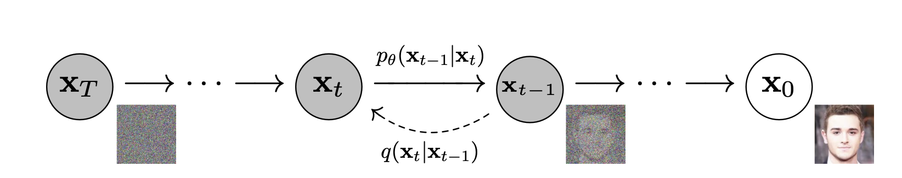
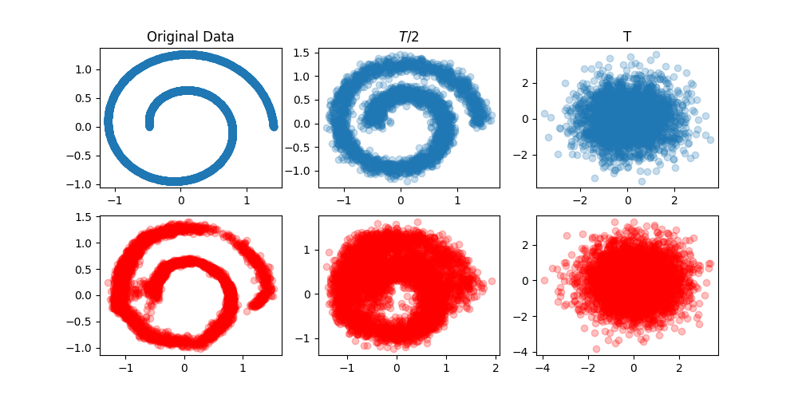

# Intuitions on difusion models

In this repository contains a collection of scripts that I used to understand Diffusion models for image generation.

This set of scripts are based on the course from Maxime Vandergar that is shared on Udemy. Course highly recommended. I hope the author does not mind that snippets of his code are used here. If so, please let me know that I will take this repositiory down.

As you can see, I don't use jupyter notebooks, I prefer to use scripts, because I think it is easier to understand the flow of the code and also it is easier to debug. I like a lot using ipdb to debug my code.

**How to follow this README? Please, open the README in one window and the scripts in another window, so you can follow the explanation of the code.**

The installation can be done via pixi. Once this repo is cloned you can install the dependencies by running the following command:


```bash
pixi shell
pip install -r requirements.txt
```


## Basic mechanics of the diffusion model - "Deep Unsupservised Learning using Nonequilibrium Thermodynamics"

In this section the mechanics of the diffusion model are explained and this comes from the paper "Deep Unsupservised Learning using Nonequilibrium Thermodynamics" by Sohl-Dickstein et al. The paper can be found [here](https://arxiv.org/abs/1503.03585).

A Diffusion Probabilistic Model, or Diffusion Model is a generative model modeled using a parametrized Markov Chain that is trained to generate samples from a given distribution (similar to VAE, or GANs).
The so called Difusion Process consists in to each add gaussian noise in each step of the Markov Chain until the input signal is totally corrupted, and then a simple MLP is used to recover the original signal as showed in the image below.



The **forward process (corruption phase)** is given by:

$q(x_{1:T}|x_0)=\prod\limits_{t=1}^{T}q(x_t|x_{t-1})$

where $q(x_t|x_{t-1})$ can be parametrized as any well behaved distribution, but in this case it is parametrized as a Gaussian distribution as.

$q(x_t|x_{t-1})=\mathcal{N}(x_t ; \sqrt{1-\beta_t}x_{t-1},\beta_tI)$

where $\beta_t$ is the variance schedule of these distributions for each step of the Markov Chain (in an increasing order)
and $x_0$ is your training data.

The **reverse process (recovery phase)** is untractable to be computed, but it can be approximated by a simple MLP hence:

$ p_\theta(x_{0:T})=p_\theta(x_{T}) \prod\limits_{i=1}^{T} p_\theta(x_{t-1}|x_t) $

where 

$p_\theta(x_{t-1}|x_t)=\mathcal{N}(x_{t-1};\mu_\theta(x_t, t), \sigma_\theta(x_t, t)$

where $\mu_\theta(x_t, t)$ and $\sigma_\theta(x_t, t)$ are the outputs of the MLP for each step $t$.

A nice property of the difusion forward process is that it can be computed in a closed-form, so we can sample $x_t$ at any step of the Markov Chain
by doing the following:

$q(x_t|x_0)=\mathcal{N}(x_t, \sqrt{\bar{\alpha_t}}x_0), (1-\bar{\alpha_t}I)$

where $ `\bar{\alpha_t}=\prod\limits_{i=1}^{t} 1 - \beta_{i} `$.

The objective to be optimized is by maximizing the KL divergence between $p$ and $q$, which is the ELBO (Evidence Lower Bound) as in the equation below:

$- \frac{ \sum\limits_{i=0}^{N} \log(\sigma_p) - \log(\sigma_q) + \frac{\sigma_q^2 + (\mu_q - \mu_p)^2}{2 \sigma_p^2}}{N}$

This is clearly diferentiable, so we can use SGD to optimize the parameters of the MLP.

Please, run the script below to see the mechanics of the diffusion model in action.

```bash
python paper_1_partb.py
```

Running this using $T=40$ we can pretty much recover the original signal as in the image below.



## Towards better generated images - Denoising Diffusion Probabilistic Models

Here we will go through the paper "Denoising Diffusion Probabilistic Models" by Ho et al. The paper can be found [here](https://arxiv.org/abs/2006.11239).

The contribution of this paper is showing that the diffusion model can be used to generate high quality images comparable and even better than GANs and VAEs.

At first they simplified (empirically) the learning objective by setting the variance of the gaussian distribution to a fixed size $\sigma^2_t = \beta_t$, then the loss can be
simplyfied to:

$L_\text{simple}(\theta)=E_{t,x_0,\epsilon}[|| \epsilon -  \epsilon_\theta(\sqrt{\bar{\alpha_t}}x_0 + \sqrt{1-\bar{\alpha_t}}\epsilon, t)||^2]$.

Evertything is pretty much simple to be implemented except for $\epsilon_\theta$ that is parametrized with an UNET architecture.
A few things to be noted in this UNET architecture is:
 - the time parameter is encoded in a manifold using a positional encoding
 - Several self attention layers

 Well, read the unet.py script to understand the architecture of the UNET. This bit is important and I don't know why this was not ablated in the paper.

 Please, run the script below to see the mechanics of the diffusion model in action.

```bash
python paper_2.py
```
 